# 3 - Introduction to Neural Network
### Lectures
  Neural networks are the basis of Deep Learning, the mimic how the barin learns.
#### Classification Problems
  The problem of identifying to which of a set of categories (sub-populations) a new observation belongs.

  

    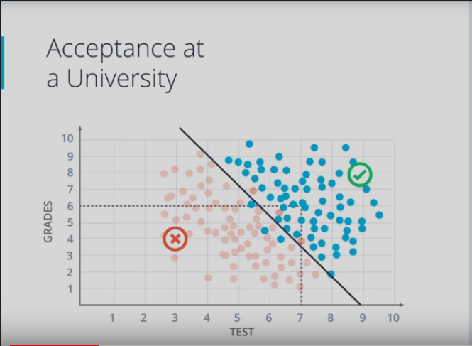
  

#### Decision Boundary
  The separator between classes learned by a model in a binary class or multi-class classification problems. For example, in the following image representing a binary classification problem, the decision boundary is the frontier between the blue class and the red class:

  * Linear Boundaries
    

      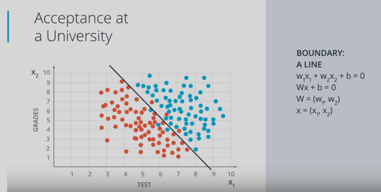
    

  * Higher Dimensions
    

      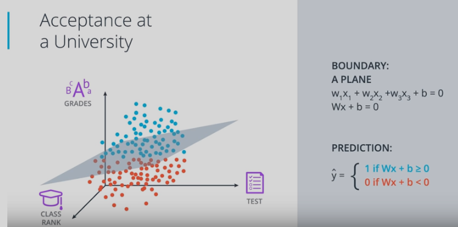
    

#### Perceptrons
  A system (either hardware or software) that takes in one or more input values, runs a function on the weighted sum of the inputs, and computes a single output value. In machine learning, the function is typically nonlinear, such as ReLU, sigmoid, or tanh.

  In the following illustration, the perceptron takes n inputs, each of which is itself modified by a weight before entering the perceptron:

  

    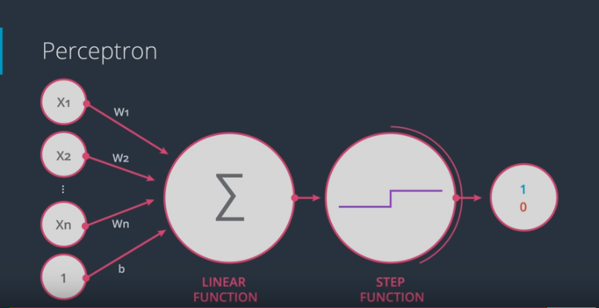
  

  A perceptron that takes in n inputs, each multiplied by separate
  weights. The perceptron outputs a single value.

  Perceptrons are the (nodes) in deep neural networks. That is, a deep neural network consists of multiple connected perceptrons, plus a backpropagation algorithm to introduce feedback.

#### Why "Neural Networks"?

  

    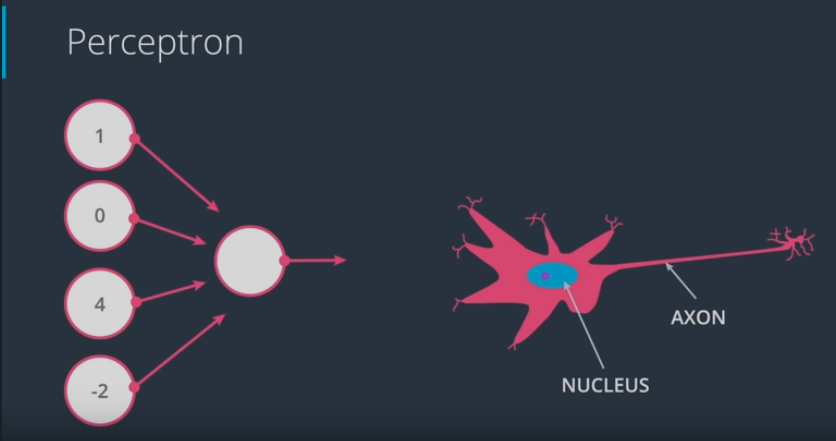
  

#### Perceptrons as Logical Operators

* AND Perceptron

  

    
  

* OR Perceptron

  

    
  

    

    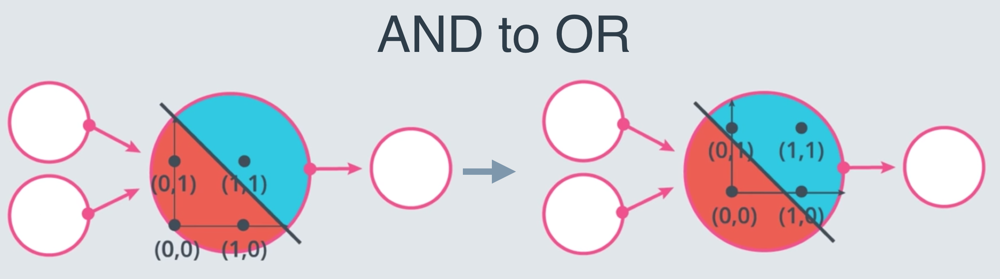
  

* NOT Perceptron
  Unlike the other perceptrons we looked at, the NOT operation only cares about one input. The operation returns a 0 if the input is 1 and a 1 if it's a 0. The other inputs to the perceptron are ignored.

* XOR Perceptron

  

    
  

#### Perceptron Trick

  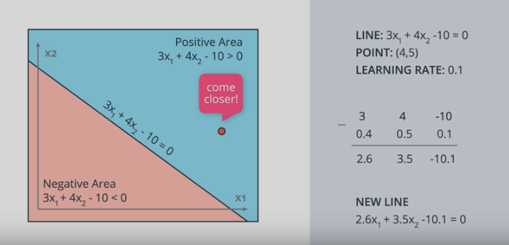

#### Perceptron Algorithm

  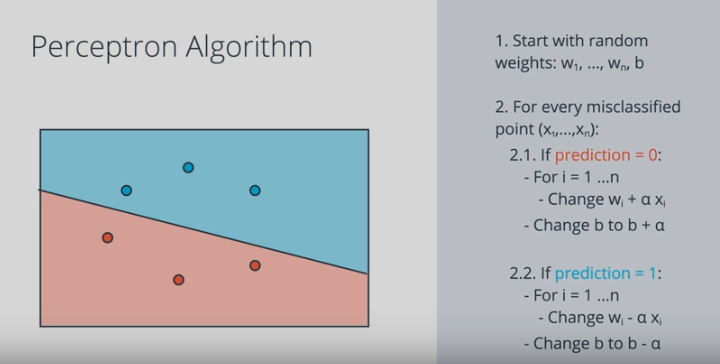

#### Non-Linear Regions

  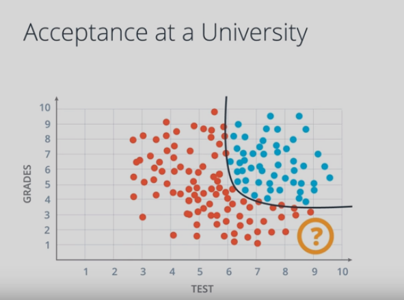

#### Error Functions

  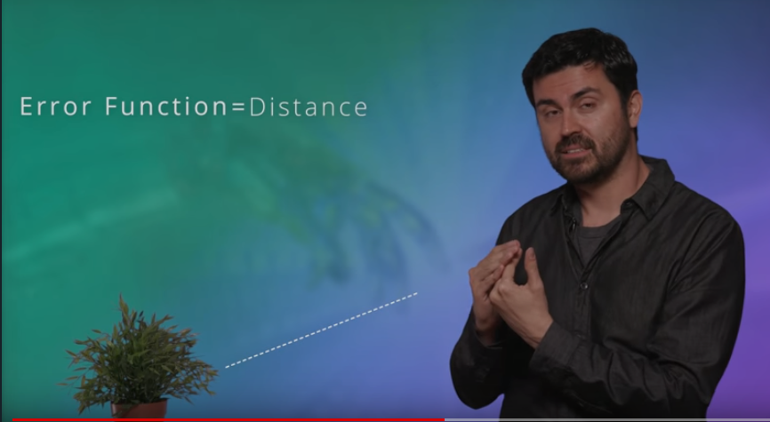

#### Log-loss Error Function

  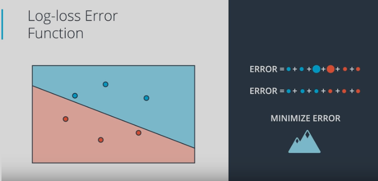

#### Discrete vs Continous

  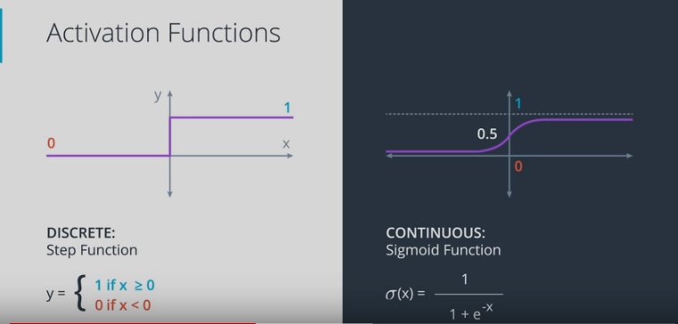

#### Softmax
A function that provides probabilities for each possible class in a multi-class classification model. The probabilities add up to exactly 1.0. For example, softmax might determine that the probability of a particular image being a duck at 0.67, a beaver at 0.33, and a walrus at 0. (Also called full softmax.)

  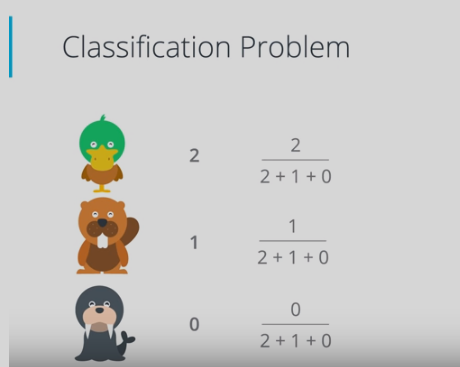

#### One-Hot Encoding

A sparse vector in which:

* One element is set to 1.
* All other elements are set to 0.

One-hot encoding is commonly used to represent strings or identifiers that have a finite set of possible values. For example, suppose a given botany data set chronicles 15,000 different species, each denoted with a unique string identifier. As part of feature engineering, you'll probably encode those string identifiers as one-hot vectors in which the vector has a size of 15,000.

  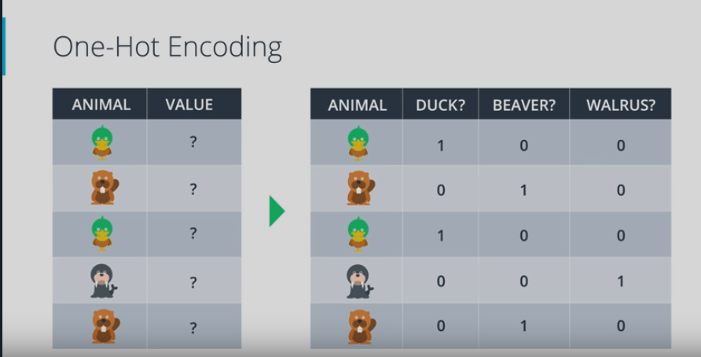

#### Maximum Likelihood

  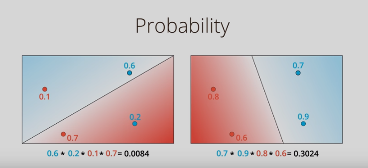

#### Cross-Entropy

A generalization of Log Loss to multi-class classification problems. Cross-entropy quantifies the difference between two probability distributions.

  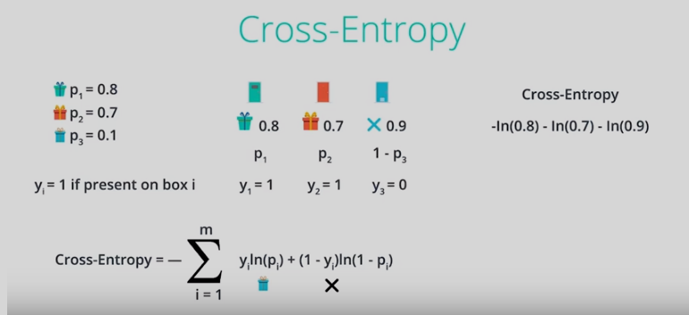

#### Multi-Class Cross Entropy

  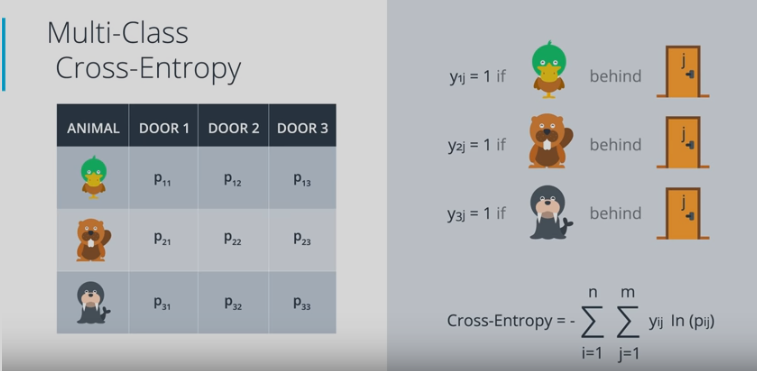

#### Logistic Regression
A model that generates a probability for each possible discrete label value in classification problems by applying a sigmoid function to a linear prediction. Although logistic regression is often used in binary classification problems, it can also be used in multi-class classification problems (where it becomes called multi-class logistic regression or multinomial regression).

  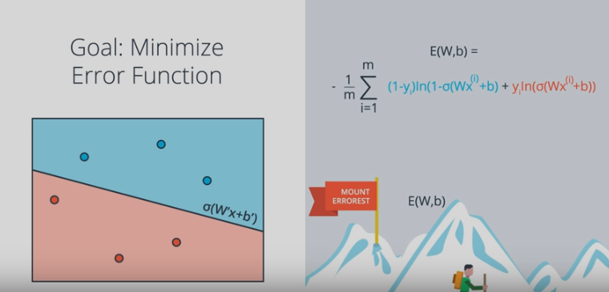

#### Gradient Descent
A technique to minimize loss by computing the gradients of loss with respect to the model's parameters, conditioned on training data. Informally, gradient descent iteratively adjusts parameters, gradually finding the best combination of weights and bias to minimize loss.

  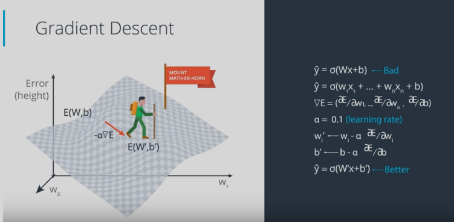

#### Feedforward

  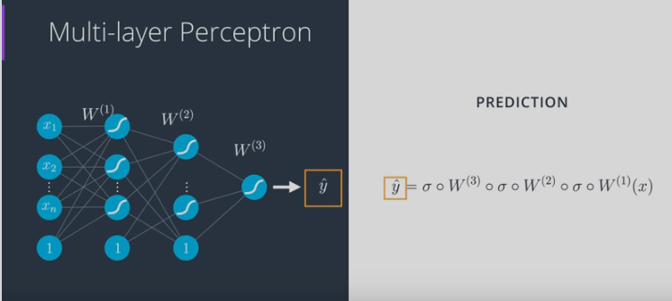

#### Backpropagation
The primary algorithm for performing gradient descent on neural networks. First, the output values of each node are calculated (and cached) in a forward pass. Then, the partial derivative of the error with respect to each parameter is calculated in a backward pass through the graph.

  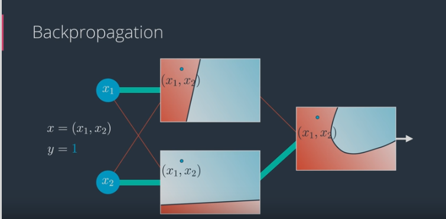

#### Overfitting & Underfitting
##### Overfitting
Creating a model that matches the training data so closely that the model fails to make correct predictions on new data.
This error due to high variance.

##### Underfitting
Producing a model with poor predictive ability because the model hasn't captured the complexity of the training data. Many problems can cause underfitting, including:

* Training on the wrong set of features.
* Training for too few epochs or at too low a learning rate.
* Training with too high a regularization rate.
* Providing too few hidden layers in a deep neural network.

This error due to high bias

  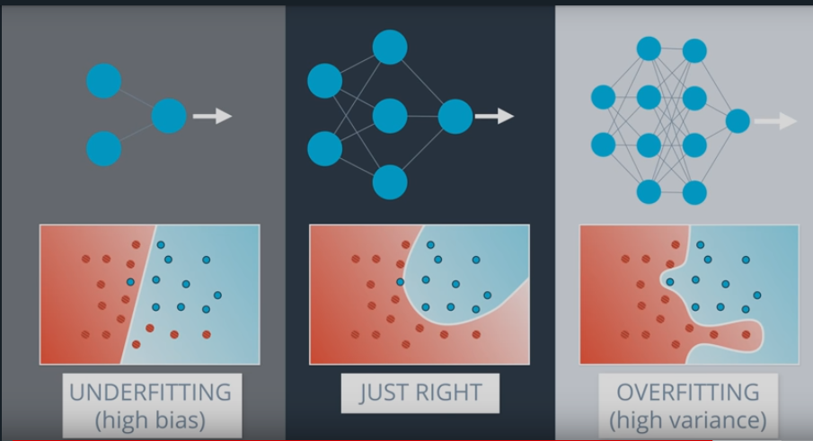

#### Early Stopping
A method for regularization that involves ending model training before training loss finishes decreasing. In early stopping, you end model training when the loss on a validation data set starts to increase, that is, when generalization performance worsens.

  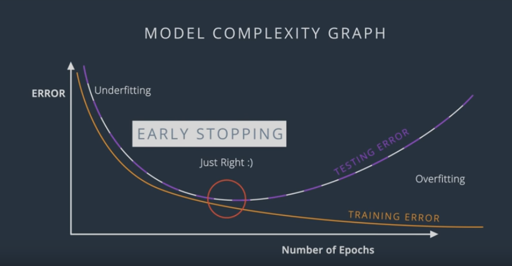

#### Regularization
The penalty on a model's complexity. Regularization helps prevent overfitting. Different kinds of regularization include:

* L1 regularization
* L2 regularization
* Dropout 
* Early stopping : This method prevents Overfitting. We track the loss on the validation set during the training phase and use it to determine when to stop training such that the model is accurate but not overfitting

  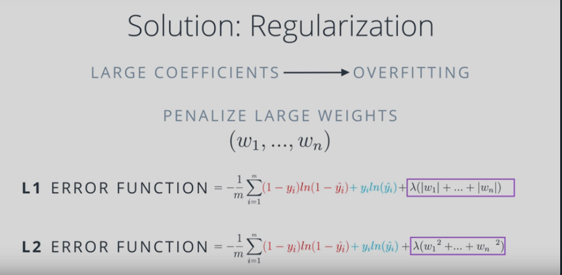

#### Dropout
A form of regularization useful in training neural networks. Dropout regularization works by removing a random selection of a fixed number of the units in a network layer for a single gradient step. The more units dropped out, the stronger the regularization. This is analogous to training the network to emulate an exponentially large ensemble of smaller networks.

  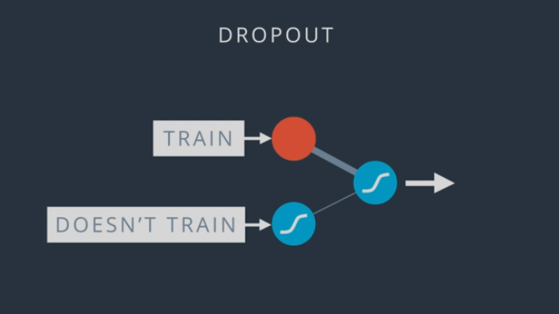

#### Local Minima

  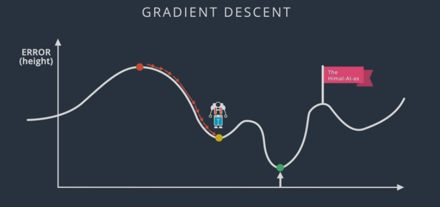

#### Random Restart

  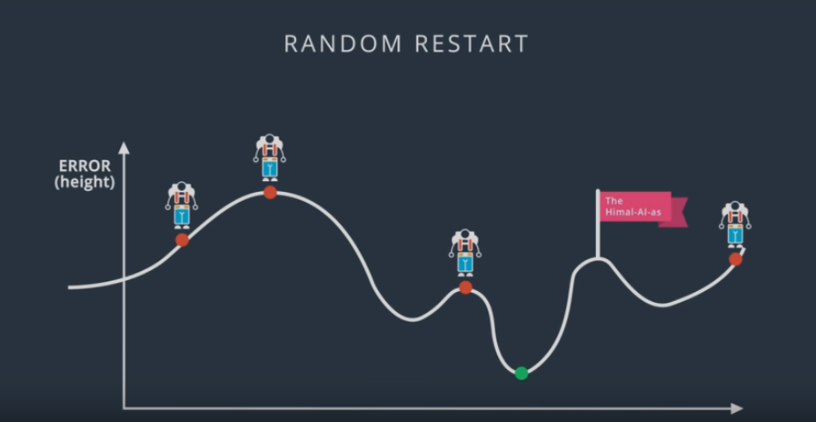

#### Momentum
A sophisticated gradient descent algorithm in which a learning step depends not only on the derivative in the current step, but also on the derivatives of the step(s) that immediately preceded it. Momentum involves computing an exponentially weighted moving average of the gradients over time, analogous to momentum in physics. Momentum sometimes prevents learning from getting stuck in local minima.

  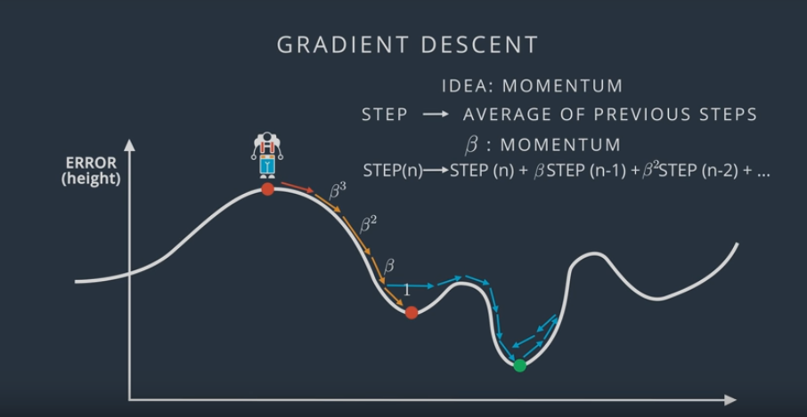

### Quizzes
* [Centurion's Note](https://files.slack.com/files-pri/TDBKE3X9D-FE3CP0FNW/download/udacity-pytorch-lesson2-notes.pdf)

### Notebooks
* [Gradient Descent](https://github.com/agungsantoso/deep-learning-v2-pytorch/blob/master/intro-neural-networks/gradient-descent/GradientDescent.ipynb)
* [Analyzing Student Data](https://github.com/agungsantoso/deep-learning-v2-pytorch/blob/master/intro-neural-networks/student-admissions/StudentAdmissions.ipynb)

