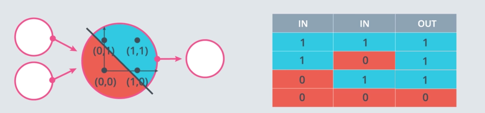

# 3 - Introduction to Neural Network
### Lectures
  Neural networks are the basis of Deep Learning, the mimic how the barin learns.
#### Classification Problems
  The problem of identifying to which of a set of categories (sub-populations) a new observation belongs.

  

    
  

#### Decision Boundary
  The separator between classes learned by a model in a binary class or multi-class classification problems. For example, in the following image representing a binary classification problem, the decision boundary is the frontier between the blue class and the red class:

  * Linear Boundaries
    

      
    

  * Higher Dimensions
    

      
    

#### Perceptrons
  A system (either hardware or software) that takes in one or more input values, runs a function on the weighted sum of the inputs, and computes a single output value. In machine learning, the function is typically nonlinear, such as ReLU, sigmoid, or tanh.

  In the following illustration, the perceptron takes n inputs, each of which is itself modified by a weight before entering the perceptron:

  

    
  

  A perceptron that takes in n inputs, each multiplied by separate
  weights. The perceptron outputs a single value.

  Perceptrons are the (nodes) in deep neural networks. That is, a deep neural network consists of multiple connected perceptrons, plus a backpropagation algorithm to introduce feedback.

#### Why "Neural Networks"?

  

    
  

#### Perceptrons as Logical Operators

* AND Perceptron

  

    
  

* OR Perceptron

  

    
  

    

    
  

* NOT Perceptron
  Unlike the other perceptrons we looked at, the NOT operation only cares about one input. The operation returns a 0 if the input is 1 and a 1 if it's a 0. The other inputs to the perceptron are ignored.

* XOR Perceptron

  

    
  

#### Perceptron Trick

  

#### Perceptron Algorithm

  

#### Non-Linear Regions

  

#### Error Functions
Error function if a way to measure how far we are from the optimal solution. Error function should be able to see arbitrary small variations to show which way to move, that is why it should be continuous. If it is discreet, then there is no way to tell where
to go, because every direction may look the same

  

#### Log-loss Error Function

  

#### Discrete vs Continous

  

#### Softmax
A function that provides probabilities for each possible class in a multi-class classification model.Softmax function is a generalization of sigmoid function that is used in the multi-class classification problems (while sigmoid is inherently binary). Softmax function normalizes the scores so that the final outputs for all classes sums up to 1 while individual outputs represent the probability of a point to belong to some class.
The probabilities add up to exactly 1.0. For example, softmax might determine that the probability of a particular image being a duck at 0.67, a beaver at 0.33, and a walrus at 0. (Also called full softmax.)

  

#### One-Hot Encoding
One-hot encoding is a way to convert categorical variables to binary vectors
A sparse vector in which:

* One element is set to 1.
* All other elements are set to 0.

One-hot encoding is commonly used to represent strings or identifiers that have a finite set of possible values. For example, suppose a given botany data set chronicles 15,000 different species, each denoted with a unique string identifier. As part of feature engineering, you'll probably encode those string identifiers as one-hot vectors in which the vector has a size of 15,000.

  

#### Maximum Likelihood
How to understand whether a model is good or bad? Compare it to the reality! For example, suppose you build a model to predict weather, if the model says that there is 90% chance of rain and 10% chance of sun, but in reality, you see absolutely cloudless sky, then the model is bad.
Likelihood is a function that describes the plausibility of a model parameter value, given specific observed data.
Maximum Likelihood is a state when the modelhas parameters which maximize the likelihood function

  

#### Cross-Entropy

Cross-entropy is an elaboration of maximum likelihood principle. The main motivation is to turn products into sums with the 𝑙𝑜𝑔 function. Deep Learning usually involves a lot of manipulations with the numbers in [0,1] interval, but when we multiply a lot of small numbers together the resulting product can be vanishingly small so it is better to work with sums instead of products.
A generalization of Log Loss to multi-class classification problems. Cross-entropy quantifies the difference between two probability distributions.

  

Our Objective is to minimize the cross-entropy and maximize the likelihood
#### Multi-Class Cross Entropy

  

#### Logistic Regression
Logistic regression is basically a linear regression combined with logistic (sigmoid) function. Gradient descent is used to optimize the parameters.
A model that generates a probability for each possible discrete label value in classification problems by applying a sigmoid function to a linear prediction. Although logistic regression is often used in binary classification problems, it can also be used in multi-class classification problems (where it becomes called multi-class logistic regression or multinomial regression).

  

#### Gradient Descent
A technique to minimize loss by computing the gradients of loss with respect to the model's parameters, conditioned on training data. Informally, gradient descent iteratively adjusts parameters, gradually finding the best combination of weights and bias to minimize loss.

  

#### Feedforward
During the feedforwarding step, we apply a sequence of linear models and sigmoid functions to the input and propagate it through all neurons to get the final predictions. The process is similar to the process employed in the simple (one-neuron) perceptron, but instead of just one transformation, the original input undergoes a series of transformations through numerous neurons. Output of one neuron becomes input to another neuron.

  

#### Backpropagation
Feedforwarding is basically a composition of a bunch of functions. Backpropagation involves taking derivatives of each component of that composition in order to know how each parameter influence the error function. This allows us to adjust each weight accordingly.
It is the primary algorithm for performing gradient descent on neural networks. First, the output values of each node are calculated (and cached) in a forward pass. Then, the partial derivative of the error with respect to each parameter is calculated in a backward pass through the graph.

  

#### Overfitting & Underfitting
##### Overfitting
Overfitting is trying to solve a problem with overcomplicated solution.
Creating a model that matches the training data so closely that the model fails to make correct predictions on new data.
This error due to high variance.

##### Underfitting
Underfitting is trying to solve a problem with oversimplified solution
Producing a model with poor predictive ability because the model hasn't captured the complexity of the training data. Many problems can cause underfitting, including:

* Training on the wrong set of features.
* Training for too few epochs or at too low a learning rate.
* Training with too high a regularization rate.
* Providing too few hidden layers in a deep neural network.

This error due to high bias

  

#### Early Stopping
A method for regularization that involves ending model training before training loss finishes decreasing. In early stopping, you end model training when the loss on a validation data set starts to increase, that is, when generalization performance worsens.

  

Early stopping is stopping the training process when test error starts to go up.

#### Regularization
Regularization means punishing large weights by adding special regularization term to the error function. This regularization term consists of magnitude of weights multiplied by hyperparameter 𝜆. 𝜆 – is a number in the [0,1] interval and it tells how much we should punish large weights.
The penalty on a model's complexity. Regularization helps prevent overfitting. Different kinds of regularization include:

* L1 regularization
* L2 regularization
* Dropout 
* Early stopping : This method prevents Overfitting. We track the loss on the validation set during the training phase and use it to determine when to stop training such that the model is accurate but not overfitting

  

#### Dropout
Dropout is a technique that involves freezing a neuron temporarily so it will not participate in the training in order for other neurons to have more ‘responsibility’.
A form of regularization useful in training neural networks. Dropout regularization works by removing a random selection of a fixed number of the units in a network layer for a single gradient step. The more units dropped out, the stronger the regularization. This is analogous to training the network to emulate an exponentially large ensemble of smaller networks.

  

#### Local Minima
Sometimes the model can be stuck in the suboptimal solution. There are a couple of ways to overcome this problem: random restart and momentum are one of them

  

#### Random Restart
Random restart is a restart of the training process with differently initialized weights

  

#### Momentum
Momentum technique allows to jump through the local minimum.
It is a sophisticated gradient descent algorithm in which a learning step depends not only on the derivative in the current step, but also on the derivatives of the step(s) that immediately preceded it. Momentum involves computing an exponentially weighted moving average of the gradients over time, analogous to momentum in physics. Momentum sometimes prevents learning from getting stuck in local minima.

  

#### Learning rate decay 
Learning rate decay is a process of decreasing the learning rate over the course of training. This sometimes helps to prevent jumping over the minimum.

#### Vanishing gradient and activation functions
The backpropagation step involves taking a lot of products of the numbers below zero, so sometimes gradients become vanishingly small as the slope of sigmoid function if quite small when the function approaches 1 or 0. So, there are some other activation functions that can help to diminish the problem

### Notebooks
* [Gradient Descent](https://github.com/agungsantoso/deep-learning-v2-pytorch/blob/master/intro-neural-networks/gradient-descent/GradientDescent.ipynb)
* [Analyzing Student Data](https://github.com/agungsantoso/deep-learning-v2-pytorch/blob/master/intro-neural-networks/student-admissions/StudentAdmissions.ipynb)

