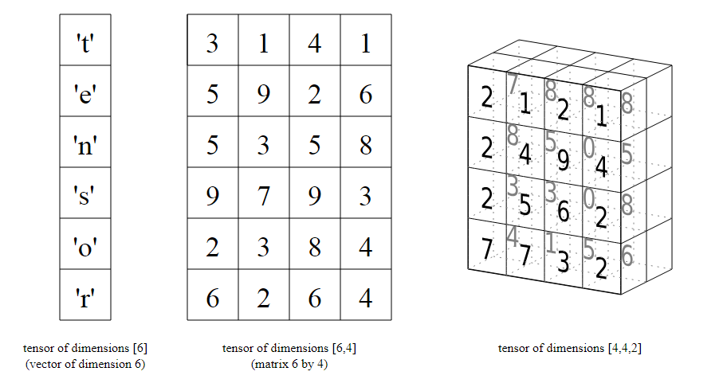

# 5 - Introduction to PyTorch
### Lectures

#### Single layer neural networks
* Tensor

The primary data structure in TensorFlow programs. Tensors are N-dimensional (where N could be very large) data structures, most commonly scalars, vectors, or matrices. The elements of a Tensor can hold integer, floating-point, or string values.
<p align="center">
  
</p>

* [torch.sum()](https://pytorch.org/docs/stable/torch.html#torch.sum)
* [torch.mm()](https://pytorch.org/docs/stable/torch.html#torch.mm)
* [torch.matmul()](https://pytorch.org/docs/stable/torch.html#torch.matmul)
* [tensor.reshape()](https://pytorch.org/docs/stable/tensors.html#torch.Tensor.reshape)
* [tensor.resize()](https://pytorch.org/docs/stable/tensors.html#torch.Tensor.resize_)
* [tensor.view()](https://pytorch.org/docs/stable/tensors.html#torch.Tensor.view)

#### Networks Using Matrix Multiplication
* hyperparameter

The "knobs" that you tweak during successive runs of training a model. For example, learning rate is a hyperparameter.

#### Neural Networks in PyTorch
* Neural network

A model that, taking inspiration from the brain, is composed of layers (at least one of which is hidden) consisting of simple connected units or neurons followed by nonlinearities.

* MNIST (Modified National Institute of Standards and Technology database)

A public-domain data set compiled by LeCun, Cortes, and Burges containing 60,000 images, each image showing how a human manually wrote a particular digit from 0–9. Each image is stored as a 28x28 array of integers, where each integer is a grayscale value between 0 and 255, inclusive.
<p align="center">
  
</p>

* activation function

A function (for example, ReLU or sigmoid) that takes in the weighted sum of all of the inputs from the previous layer and then generates and passes an output value (typically nonlinear) to the next layer.
 
 * [nn.Sequential](https://pytorch.org/docs/master/nn.html#torch.nn.Sequential)

#### Network Architectures in PyTorch
* Backpropagation

The primary algorithm for performing gradient descent on neural networks. First, the output values of each node are calculated (and cached) in a forward pass. Then, the partial derivative of the error with respect to each parameter is calculated in a backward pass through the graph.

* Batch

The set of examples used in one iteration (that is, one gradient update) of model training.

* Batch size

The number of examples in a batch. For example, the batch size of SGD is 1, while the batch size of a mini-batch is usually between 10 and 1000. Batch size is usually fixed during training and inference;

* Cross-entropy

A generalization of Log Loss to multi-class classification problems. Cross-entropy quantifies the difference between two probability distributions

* Epoch

A full training pass over the entire data set such that each example has been seen once. Thus, an epoch represents N/batch size training iterations, where N is the total number of examples.

* Hidden layer

A synthetic layer in a neural network between the input layer (that is, the features) and the output layer (the prediction). Hidden layers typically contain an activation function (such as ReLU) for training. A deep neural network contains more than one hidden layer.

* Logits

The vector of raw (non-normalized) predictions that a classification model generates, which is ordinarily then passed to a normalization function. If the model is solving a multi-class classification problem, logits typically become an input to the softmax function. The softmax function then generates a vector of (normalized) probabilities with one value for each possible class.

* Optimizer

A specific implementation of the gradient descent algorithm.

* Step

A forward and backward evaluation of one batch.
step size
Synonym for learning rate.

* stochastic gradient descent (SGD)

A gradient descent algorithm in which the batch size is one. In other words, SGD relies on a single example chosen uniformly at random from a data set to calculate an estimate of the gradient at each step.

* [nn.CrossEntropyLoss](https://pytorch.org/docs/stable/nn.html#torch.nn.CrossEntropyLoss)
* [nn.LogSoftmax](https://pytorch.org/docs/stable/nn.html#torch.nn.LogSoftmax)
* [nn.NLLLoss](https://pytorch.org/docs/stable/nn.html#torch.nn.NLLLoss)
* [Optim Package](https://pytorch.org/docs/stable/optim.html)

#### Classifying Fashion-MNIST
* [the criterion](https://pytorch.org/docs/master/nn.html#loss-functions)
* [the optimizer](http://pytorch.org/docs/master/optim.html)

#### Inference and Validation
* Dropout regularization

A form of regularization useful in training neural networks. Dropout regularization works by removing a random selection of a fixed number of the units in a network layer for a single gradient step. The more units dropped out, the stronger the regularization. This is analogous to training the network to emulate an exponentially large ensemble of smaller networks.

* Inference

In machine learning, often refers to the process of making predictions by applying the trained model to unlabeled examples. In statistics, inference refers to the process of fitting the parameters of a distribution conditioned on some observed data. (See the Wikipedia article on statistical inference.)

* Overfitting

Creating a model that matches the training data so closely that the model fails to make correct predictions on new data.

*Precision

A metric for classification models. Precision identifies the frequency with which a model was correct when predicting the positive class.

* Recall

A metric for classification models that answers the following question: Out of all the possible positive labels, how many did the model correctly identify?

* validation set

A subset of the data set—disjunct from the training set—that you use to adjust hyperparameters.

* [nn.Dropout](https://pytorch.org/docs/stable/nn.html#torch.nn.Dropout)

#### Saving and Loading Models
* Checkpoint

Data that captures the state of the variables of a model at a particular time. Checkpoints enable exporting model weights, as well as performing training across multiple sessions. Checkpoints also enable training to continue past errors (for example, job preemption). Note that the graph itself is not included in a checkpoint.

#### Loading Image Data
* [`datasets.ImageFolder`](http://pytorch.org/docs/master/torchvision/datasets.html#imagefolder)
* [`transforms`](http://pytorch.org/docs/master/torchvision/transforms.html)
  * [`DataLoader`]  (http://pytorch.org/docs/master/data.html#torch.utils.data.DataLoader)

#### Transfer Learning
* [model](http://pytorch.org/docs/0.3.0/torchvision/models.html)
* [CUDA](https://developer.nvidia.com/cuda-zone)

#### Tips, Tricks, and Other Notes
* Make use of the .shape method during debugging and development.
* Make sure you're clearing the gradients in the training loop with `optimizer.zero_grad()`. 
* If you're doing a validation loop, be sure to set the network to evaluation mode with `model.eval()`, then back to training mode with `model.train()`.
* If you're trying to run your network on the GPU, check to make sure you've moved the model and all necessary tensors to the GPU with `.to(device)` where device is either `"cuda"` or `"cpu"`

### Notebooks
* [Tensors in PyTorch](https://github.com/agungsantoso/deep-learning-v2-pytorch/blob/master/intro-to-pytorch/Part%201%20-%20Tensors%20in%20PyTorch%20(Exercises).ipynb)
* [Neural networks with PyTorch](https://github.com/agungsantoso/deep-learning-v2-pytorch/blob/master/intro-to-pytorch/Part%202%20-%20Neural%20Networks%20in%20PyTorch%20(Exercises).ipynb)
* [Training Neural Networks](https://github.com/agungsantoso/deep-learning-v2-pytorch/blob/master/intro-to-pytorch/Part%203%20-%20Training%20Neural%20Networks%20(Exercises).ipynb)
* [Classifying Fashion-MNIST](https://github.com/agungsantoso/deep-learning-v2-pytorch/blob/master/intro-to-pytorch/Part%204%20-%20Fashion-MNIST%20(Exercises).ipynb)
* [Inference and Validation](https://github.com/agungsantoso/deep-learning-v2-pytorch/blob/master/intro-to-pytorch/Part%205%20-%20Inference%20and%20Validation%20(Exercises).ipynb)
* [Saving and Loading Models](https://github.com/agungsantoso/deep-learning-v2-pytorch/blob/master/intro-to-pytorch/Part%206%20-%20Saving%20and%20Loading%20Models.ipynb)
* [Loading Image Data](https://colab.research.google.com/github/agungsantoso/deep-learning-v2-pytorch/blob/master/intro-to-pytorch/Part%207%20-%20Loading%20Image%20Data%20(Exercises).ipynb#scrollTo=IVfPhjj-OCqv)
* [Transfer Learning](https://colab.research.google.com/github/agungsantoso/deep-learning-v2-pytorch/blob/master/intro-to-pytorch/Part%208%20-%20Transfer%20Learning%20(Exercises).ipynb#scrollTo=4_6rfBV_RLSA)

### Tips & Trick
#### [Things to run torch Training with GPU in colab](https://pytorchfbchallenge.slack.com/archives/CE15VH5KJ/p1543083497415500)
* install pytorch
```
# http://pytorch.org/
from os.path import exists
from wheel.pep425tags import get_abbr_impl, get_impl_ver, get_abi_tag
platform = '{}{}-{}'.format(get_abbr_impl(), get_impl_ver(), get_abi_tag())
cuda_output = !ldconfig -p|grep cudart.so|sed -e 's/.*\.\([0-9]*\)\.\([0-9]*\)$/cu\1\2/'
accelerator = cuda_output[0] if exists('/dev/nvidia0') else 'cpu'

!pip install -q http://download.pytorch.org/whl/{accelerator}/torch-0.4.1-{platform}-linux_x86_64.whl torchvision
import torch
```

* download dataset
```
!wget -c https://s3.amazonaws.com/content.udacity-data.com/nd089/Cat_Dog_data.zip;
!unzip -qq Cat_Dog_data.zip;
!wget -c https://raw.githubusercontent.com/udacity/deep-learning-v2-pytorch/master/intro-to-pytorch/helper.py
```

* other dependencies
```
!pip install Pillow==4.0.0
!pip install PIL
!pip install image
import PIL
```

* Click `Runtime` - `change Run time type`
* Click `GPU`
