# 7 - Style Transfer
### Lectures

#### Style Transfer
* apply the style of one image to another image

  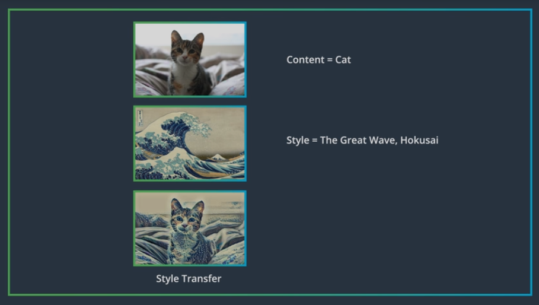

#### Separating Style & Content
* feature space designed to capture texture and color information used, essentially looks at spatial correlations within a layer of a network
* correlation is a measure of the relationship between two or more variables

  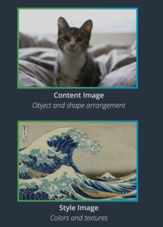

* similarities and differences between features in a layer should give some information about texture and color information found in an image, but at the same time leave out information about the actual arrangement and identitity of different objects in that image

  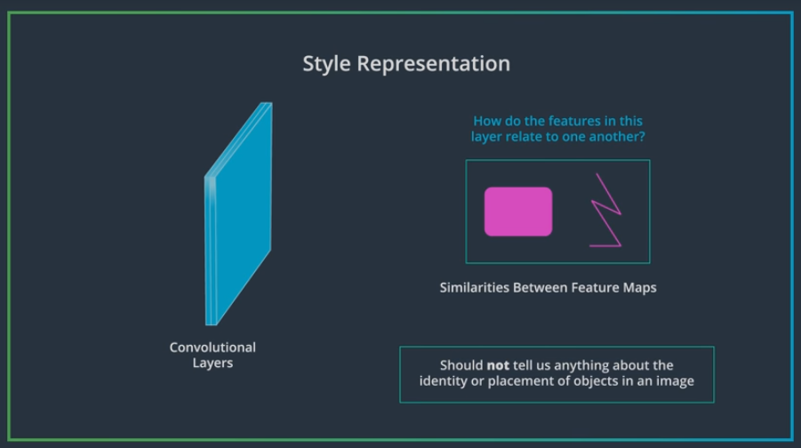

#### VGG19 & Content Loss
* VGG19 -> 19 layer VGG network

  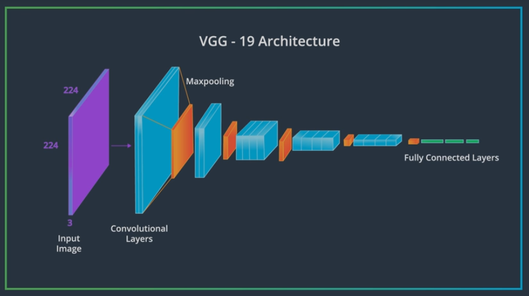

* When the network sees the __content image__, it will go through feed-forward process until it gets to a conv layer that is deep in the network, the output will be the content representation

  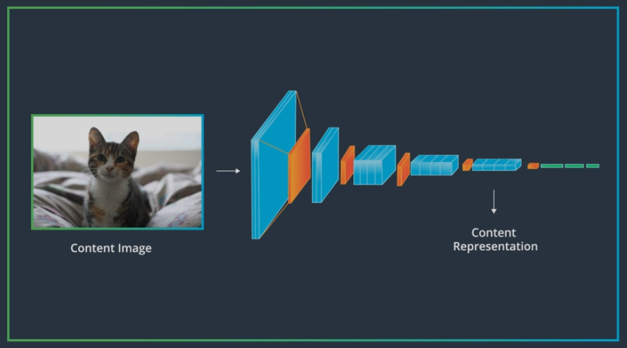

* When it sees tye __style image__, it will extract different features from multiple layers that represent the style of that image

  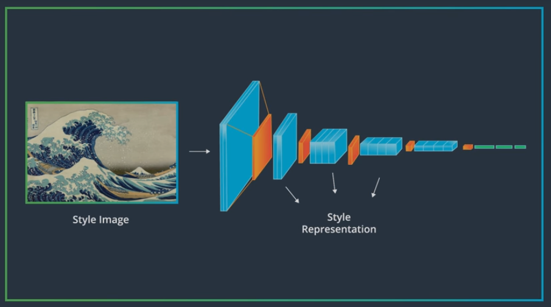

* __content loss__ is a loss that calculates the difference between the content (Cc) and target (Tc) image representation

  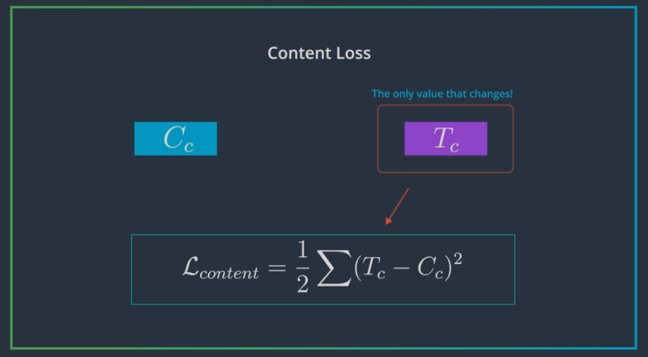

#### Gram Matrix
* Correlations at each layer in convolutional layer are given by a Gram matrix
* First step in calculating the Gram matrix, will be to vectorize the values of feature map

  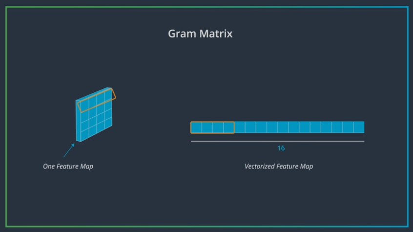

* By flattening the XY dimensions of the feature maps, we're convrting a 3D conv layer to a 2D matrix of values

  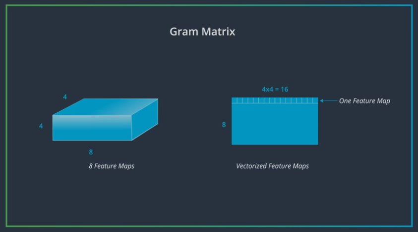

* The next step is to multiply vectorized feature map by its transpose to get the gram matrix

  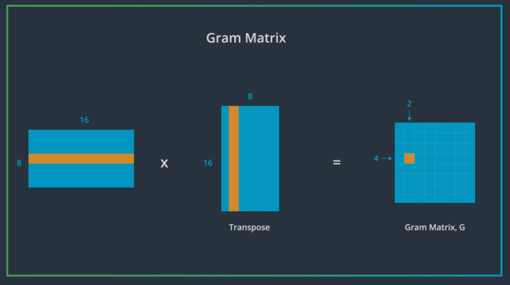

#### Style Loss

* __content loss__ is a loss that calculates the difference between the image style (Ss) and target (Ts) image style, `a` is constant that accounts for the number of values in each layer, `w` is style weights

  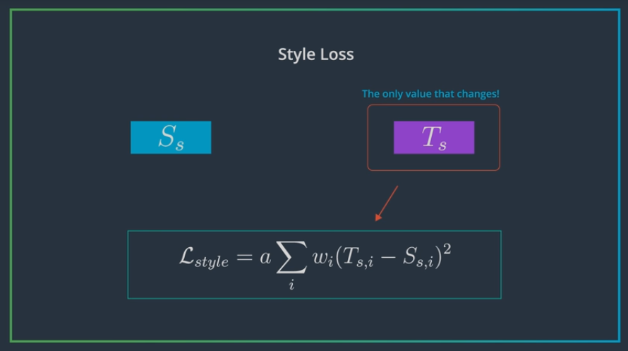

* Add together content loss and style loss to get total loss and then use typical back propagation and optimization to reduce total loss

  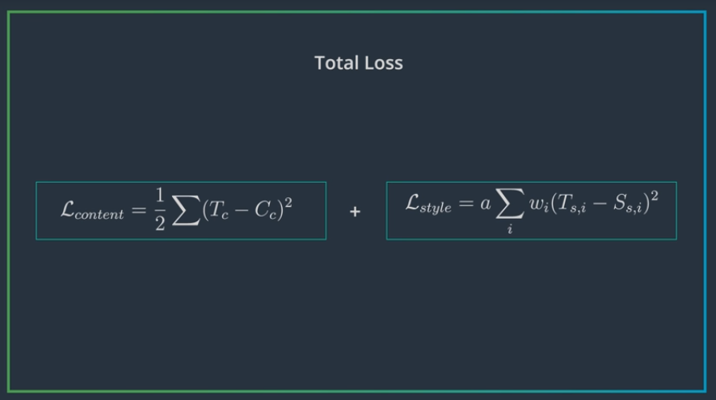

#### Loss Weights

* alpha beta ratio is ratio between alpha (content weight) and beta (style weight)

  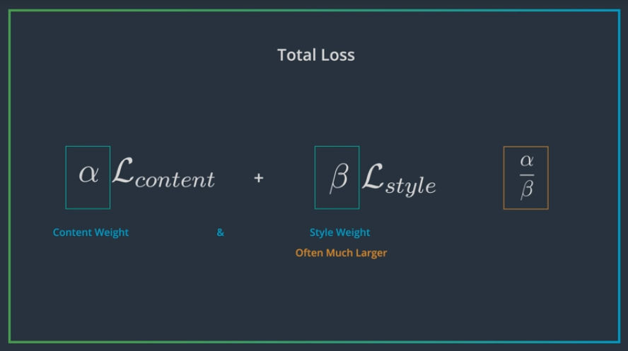

* Different alpha beta ratio can result in different generated image

  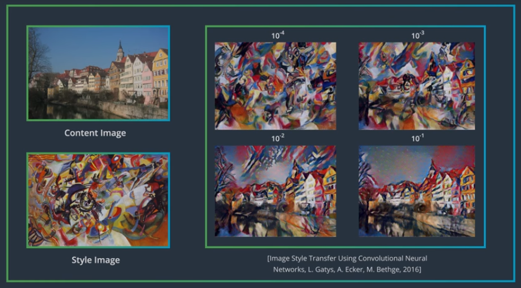

### Quizes
#### Q1 - 6.4: Gram Matrix
##### Q 1.1
* Q: Given a convolutional layer with dimensions `d x h x w = (20*8*8)`, what length will one row of the vectorized convolutional layer have? (Vectorized means that the spatial dimensions are flattened.)
* A: `64`
* E: When the height and width (8 x 8) are flattened, the resultant 2D matrix will have as many columns as the height and width, multiplied: `8*8 = 64`.

##### Q 1.2
* Q: Given a convolutional layer with dimensions `d x h x w = (20*8*8)`, what dimensions (h x w) will the resultant Gram matrix have?
* A: `(20 x 20)`
* E: The Gram matrix will be a square matrix, with a width and height = to the depth of the convolutional layer in question.

### Notebooks
* [Style Transfer with Deep Neural Networks](https://github.com/agungsantoso/deep-learning-v2-pytorch/blob/master/style-transfer/Style_Transfer_Exercise.ipynb)
