# 8 - Recurrent Neural Networks
### Lectures
#### Intro to RNNs
* RNN (__R__ ecurrent __N__ eural __N__ etworks)

  A neural network that is intentionally run multiple times, where parts of each run feed into the next run. Specifically, hidden layers from the previous run provide part of the input to the same hidden layer in the next run. Recurrent neural networks are particularly useful for evaluating sequences, so that the hidden layers can learn from previous runs of the neural network on earlier parts of the sequence.

  For example, the following figure shows a recurrent neural network that runs four times. Notice that the values learned in the hidden layers from the first run become part of the input to the same hidden layers in the second run. Similarly, the values learned in the hidden layer on the second run become part of the input to the same hidden layer in the third run. In this way, the recurrent neural network gradually trains and predicts the meaning of the entire sequence rather than just the meaning of individual words.

  

    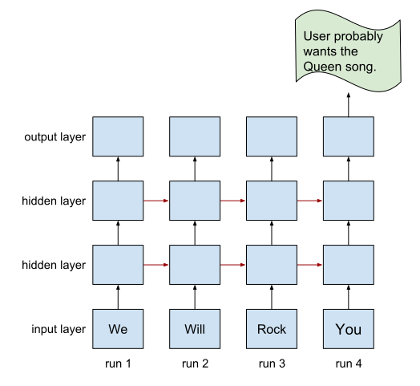
  

* LSTM (__L__ ong __S__ hort - __T__ erm __M__ emory)

  LSTM are an improvement of the RNN, and quite useful when needs to switch between remembering recent things, and things from long time ago

#### RNN vs LSTM
* RNN work as follows:
  * memory comes in an merges with a current event
  * and the output comes out as a prediction of what the input is
  * as part of the input for the next iteration of the neural network
* RNN has problem with the memory that is short term memory

  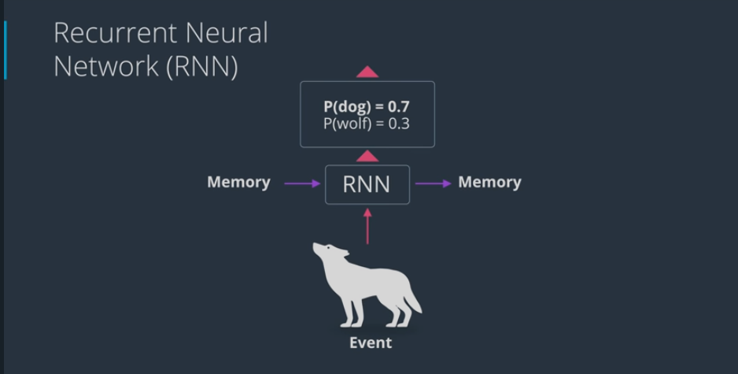

* LSTM works as follows:
  * keeps track long term memory which comes in an comes out
  * and short term memory which also comes in and comes out
* From there, we get a new long term memory, short term memory and a prediction. In here, we protect old information more.

  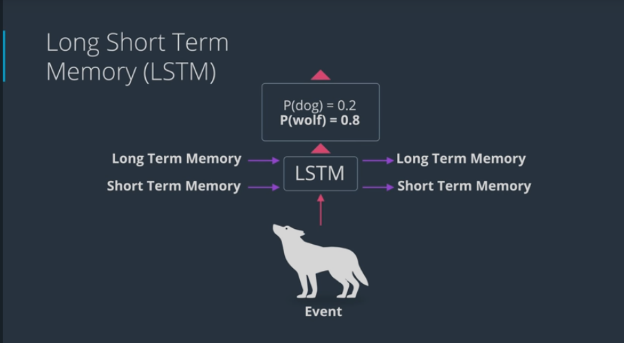

#### Basics of LSTM
* Architecture of LSTM
  * forget gate

    long term memory (__LTM__) goes here where it forgets everything that it doesn't consider useful
  * learn gate

    short term memory and event are joined together containing information that have recently learned and it removes any unecessary information
  * remember gate

    long term memory that haven't forgotten yet plus the new information that have learned get joined together to update long term memmory
  * use gate
  
    decide what information use from what previously know plus what we just learned to make a prediction. The output becomes both the prediction and the new short term memory (__STM__)

  

    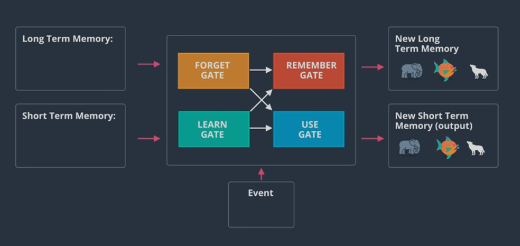
  

  

    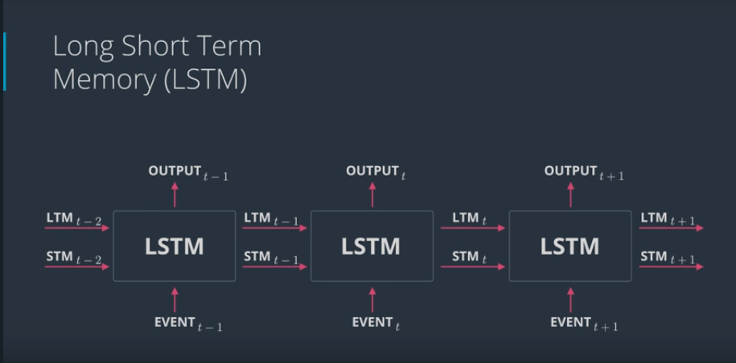
  

#### Architecture of LSTM
* RNN Architecture

  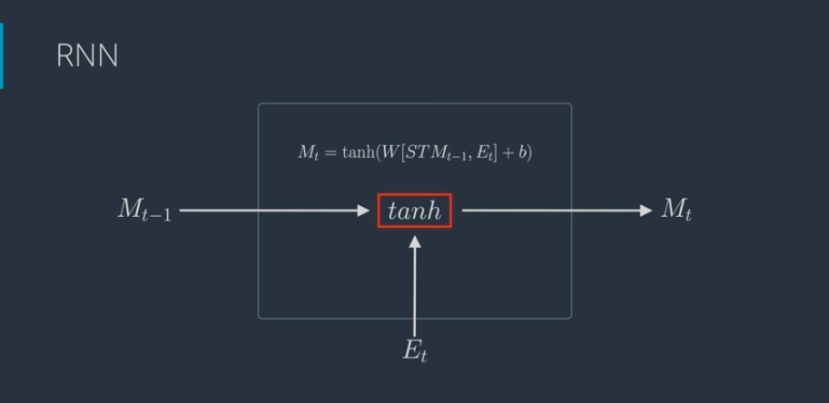

* LSTM Architecture

  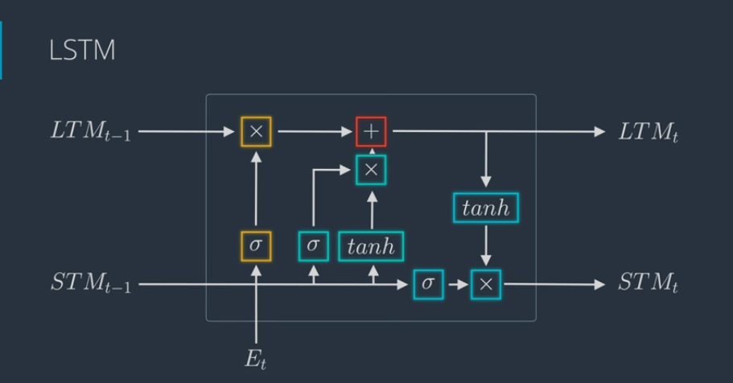

#### The Learn Gate

* Learn gate works as follows:
  * Take __STM__ and the __event__ and jonis it (use __tanh__ activation function)
  * then ignore (ignore factor) a bit to keep the important part of it (use __sigmoid__ activation function)

  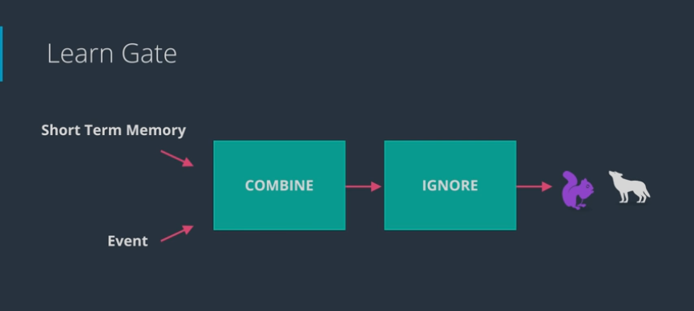

  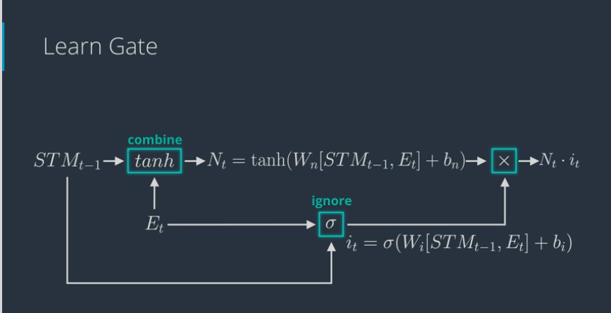

  

#### The Forget Gate

* Forget gate works as follows:
  * Take __LTM__ and decides what parts to keep and to forget (forget factor, use __sigmoid__ activation function)

  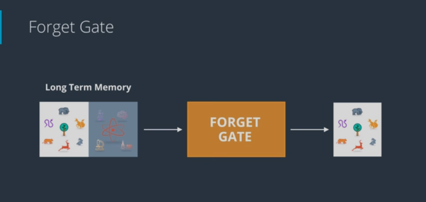

  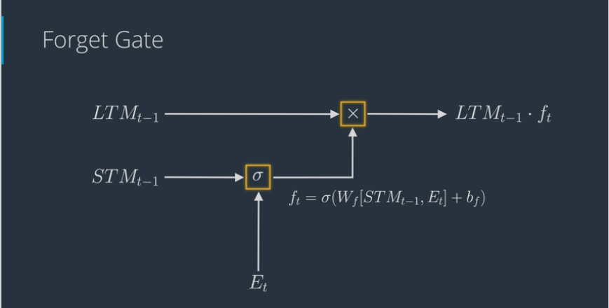

  

#### The Remember Gate

* Remember gate works as follows:
  * Take LTM coming out of forget gate and STM coming out of learn gate and combine them together

  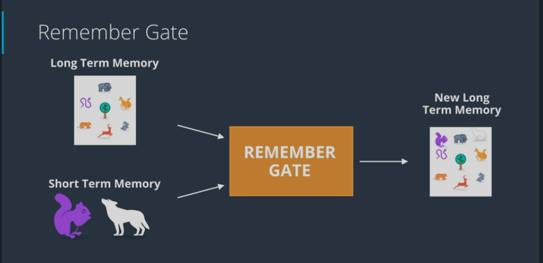

  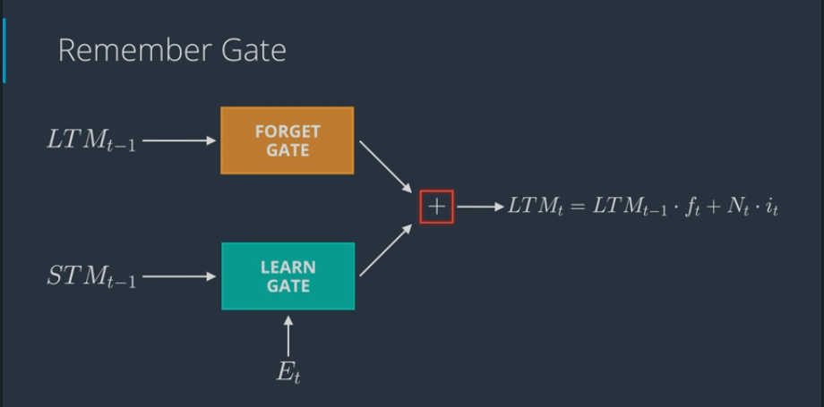

  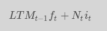

#### The Use Gate

* Remember gate works as follows:
  * Take LTM coming out of forget gate (apply __tanh__) and STM coming out of learn gate (apply __sigmoid__) to come up with a new STM and an output (multiply them together)

  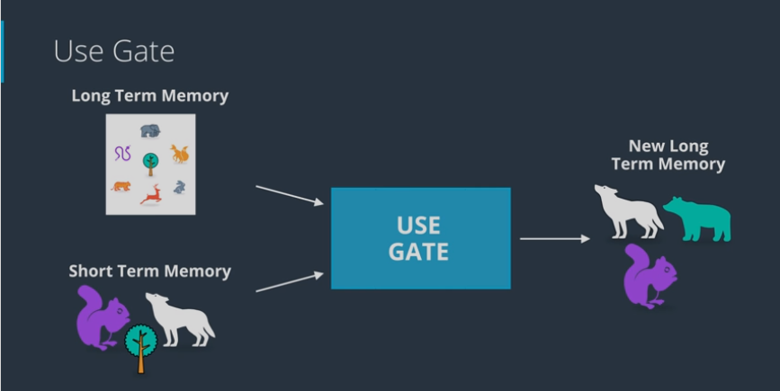

  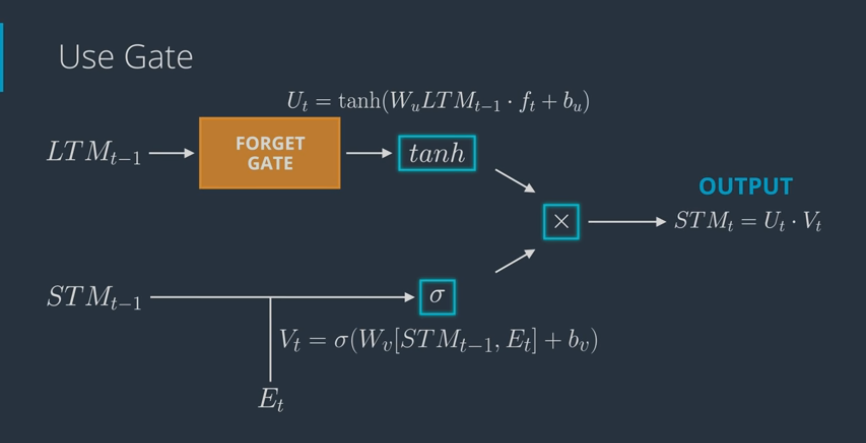

  

#### Putting it All Together

  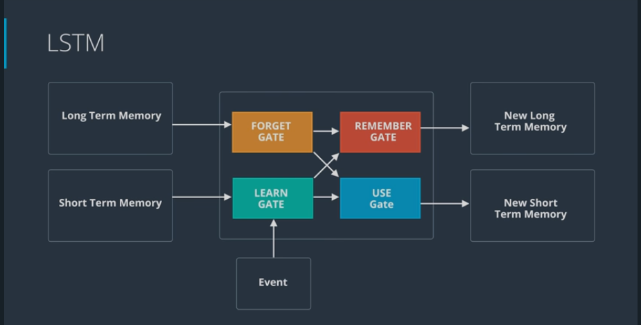

  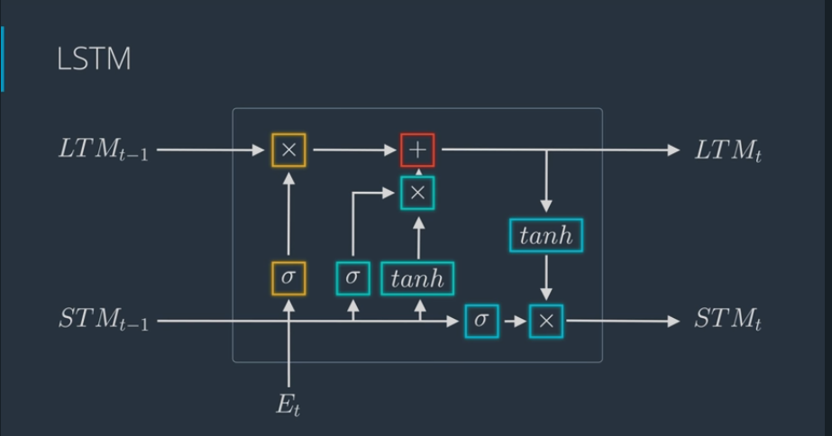

#### Other architectures
* GRU (__G__ ated __R__ ecurrent __U__ nit) 
  * combine forget and learn gate into an __update gate__
  * run this through a combine gate
  * only returns one working memory

  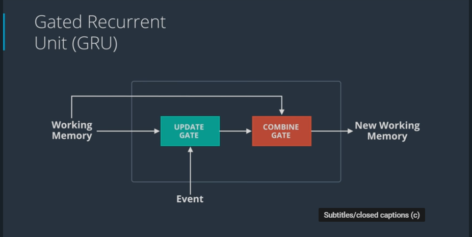

* Peephole Connections
  * forget gate which also connect LTM into neural network that calculates forget factor

  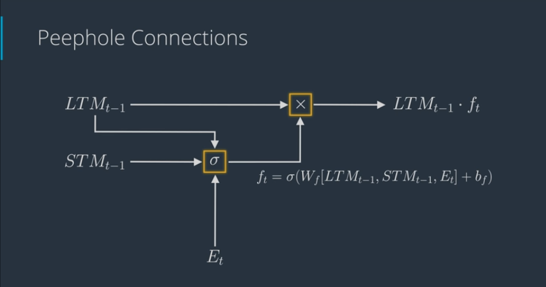

* LSTM with Peephole Connection
  * do peephole connection for every one of forget-type nodes

  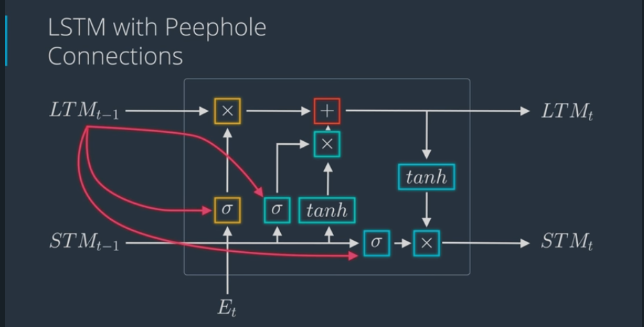

#### Character-wise RNNs
* Network will learn about some text, one character at a time and then generate new text one character at a time
* The architecture is as follows:
  * input layer will pass the characters as one hot encoded vectors
  * these vectors go to the hidden layer which built with LSTM cells
  * the output layer is used to predict to the next character (using softmax activation)
  * use cross entropy loss for training with gradient descent

  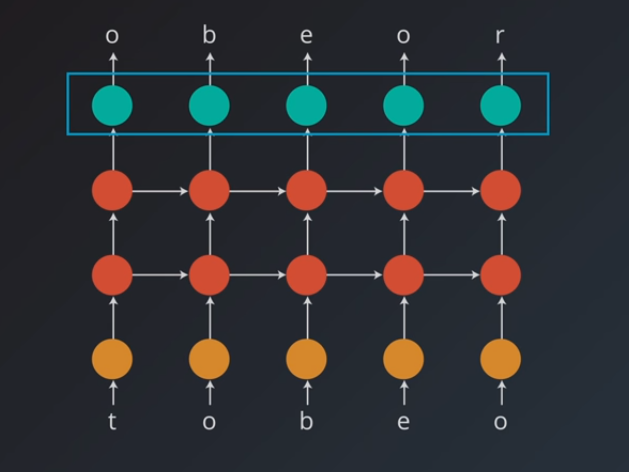

#### Sequence Batching
* Use matrix operations to make training mor efficient
* RNN training multiple sequence in parallel, for example:
  * sequence of numbers from 1 to 12
  * split it in half and pass in two sequences
  * batch size corresponds to the number of sequences we're using, here we'd say the batch size is 2
  * we can retain hidden state from one batch and use it at the start of the next batch

  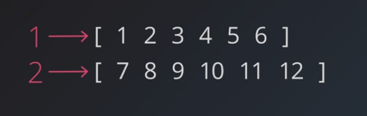

 

### Quizes
#### Q1 - Training & Memory
* Q: Say you've defined a GRU layer with `input_size = 100`, `hidden_size = 20`, and `num_layers=1`. What will the dimensions of the hidden state be if you're passing in data, batch first, in batches of 3 sequences at a time?
* A: `(1, 3, 20)`
* E: The hidden state should have dimensions: `(num_layers, batch_size, hidden_dim)`.

### Notebooks
* [Simple RNN - Time Series Prediction](https://github.com/agungsantoso/deep-learning-v2-pytorch/blob/master/recurrent-neural-networks/time-series/Simple_RNN.ipynb)
* [Character-Level LSTM in PyTorch](https://github.com/agungsantoso/deep-learning-v2-pytorch/blob/master/recurrent-neural-networks/char-rnn/Character_Level_RNN_Exercise.ipynb)
